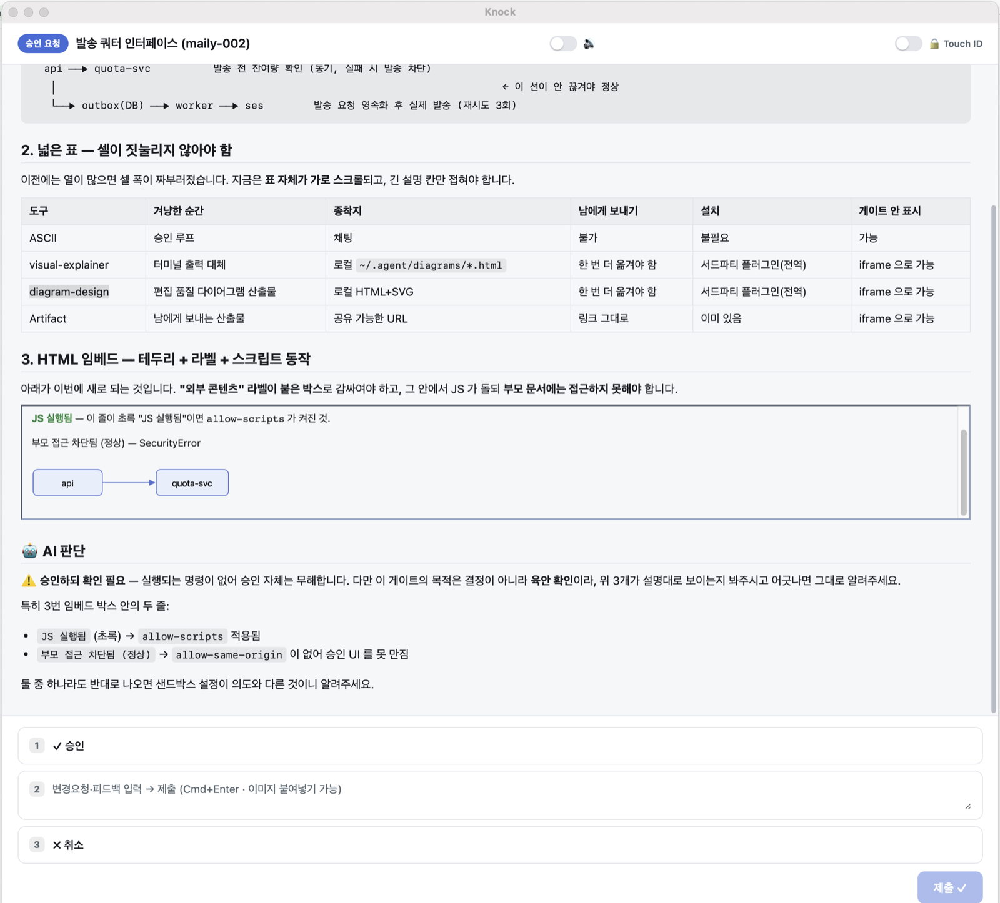
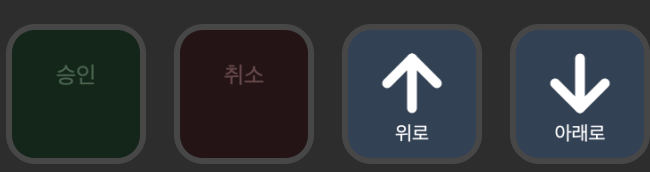

# knock

**한국어** · [English](README.en.md)

### AI 에이전트가 물어볼 때, 놓치지 마세요.

에이전트는 승인이 필요하면 터미널에 질문을 띄우고 기다립니다. 그런데 우리는 대개 다른 창을 보고 있죠. 몇 분 뒤에야 "아직 안 갔네" 하고 알게 됩니다.

knock 은 그 질문을 **화면 한가운데 창으로** 띄웁니다. 알림이 울리고, Dock 이 튀고, 키보드로 바로 답할 수 있습니다.



---

## 이런 걸 할 수 있어요

| | |
|---|---|
| **승인 받기** | 계획서·변경 내용을 창에 띄우고 승인 / 변경요청 / 취소를 받습니다 |
| **객관식으로 묻기** | 선택지를 보여주고 고르게 합니다. 키보드 숫자키로 즉시 |
| **바로 그 화면으로 보내기** | 승인하면 브라우저가 열리며 실제 행동 지점(PR·배포 화면)으로 점프합니다 |
| **지문으로 잠그기** | 되돌리기 어려운 작업엔 Touch ID / Windows Hello |
| **손으로 누르기** | Stream Deck 물리 키로 승인·취소·스크롤 |
| **한 창에 모아 보기** | 여러 에이전트가 동시에 물어도 창이 겹치지 않고 목록으로 쌓입니다 |

---

## 5분이면 시작해요

macOS(Apple Silicon) 기준입니다. Windows 는 [아래](#-windows-x64)를 보세요.

**1. 설치하기**

```bash
brew install hihenen/tap/knock
```

**2. Claude Code 에 연결하기**

```
/plugin marketplace add hihenen/knock
/plugin install knock@knock
/reload-plugins
```

**3. 항상 떠 있게 하기**

```bash
knock daemon install
```

메뉴 막대에 아이콘이 생기고, 첫 호출이 느려지지 않습니다. 안 해도 동작은 하지만, 해두는 쪽이 훨씬 편합니다.

**4. 에이전트에게 알려주기**

여기까지 하면 **계획(plan) 승인은 자동**으로 knock 창에 뜹니다. 그 외 상황까지 맡기려면 `CLAUDE.md` 에 아래를 붙여넣으세요.

<details>
<summary><b>CLAUDE.md 에 붙여넣을 내용</b> (펼치기)</summary>

```markdown
## knock — 데스크톱 승인/질문 게이트
- 사용자에게 **승인**이 필요하면 채팅 대신 `knock annotate <md> --gate --json` 게이트를 띄운다.
- **객관식 질문**은 AskUserQuestion 대신 `knock ask <json>`. JSON 최상위 `context` 에
  배경·비교표·결론을 markdown 으로 담아 결정 근거를 창에서 바로 보게 한다.
- 사용자가 **웹에서 클릭·승인**해야 하면(배포 승인 / GitHub PR / 대시보드 등)
  `--action-url <URL>` 을 넣어 승인 한 번에 브라우저로 그 행동 지점으로 점프하게 한다.
- 운영·권한·삭제 같은 critical 승인엔 `--touch-id`.
- 사용자가 **브라우저에서 여러 단계를 밟아야** 하면 `--checklist` 를 같이 준다. 승인하면 링크가
  열리고 요청은 큐에 "진행 중"으로 남아, 작업하다 다시 열어 절차를 보고 끝나면 완료를 누른다.
- 게이트 본문에 다이어그램이 필요하면 `<iframe src="https://...">` 로 넣는다(스크립트 동작).
- knock 응답: annotate=`{"decision":"approved|annotated|dismissed"}`,
  ask=`{"answers":{"<헤더>":["..."]}}`(항상 배열).
```

</details>

**끝났습니다.** 이제 어느 세션에서 물어보든 창이 뜹니다.

> 새 버전이 나오면 창 위에 배너로 알려드려요. `brew upgrade hihenen/tap/knock`

---

## 어떻게 쓰나요

### 승인 받기

```bash
knock annotate plan.md --gate --json
```

사용자가 무엇을 눌렀는지 표준출력으로 돌려줍니다. 그걸 보고 다음 행동을 정하면 됩니다.

| 사용자가 한 일 | `--json` 출력 |
|---|---|
| 승인 | `{"decision":"approved"}` |
| 변경요청 (의견 입력) | `{"decision":"annotated","feedback":"..."}` |
| 닫기 · Esc | `{"decision":"dismissed"}` |

자주 쓰는 옵션입니다.

| 옵션 | 언제 쓰나요 |
|---|---|
| `--gate` | 승인 버튼을 보여줍니다 |
| `--json` | 결과를 JSON 으로 받습니다 (없으면 사람이 읽는 문장) |
| `--title T` | 창 제목. 기본은 파일 이름 |
| `--touch-id` | 지문으로 승인받습니다. 지문이 없으면 암호나 버튼으로 넘어갑니다 |
| `--action-url <URL>` | 승인하면 그 주소를 브라우저로 엽니다 |
| `--checklist` | 승인 뒤에도 목록에 남겨둡니다. 브라우저에서 여러 단계를 밟는 동안 절차를 다시 볼 수 있어요 |

### 객관식으로 묻기

```bash
knock ask questions.json
```

Claude Code 의 AskUserQuestion 과 같은 모양이라, 쓰던 JSON 을 그대로 넣으면 됩니다.

```json
{
  "context": "## 배경\n결정에 필요한 설명을 markdown 으로. 선택지 위에 보여요.",
  "questions": [
    {
      "header": "구현 방향",
      "question": "어느 쪽으로 갈까요?",
      "options": [
        { "label": "A안", "description": "설명" },
        { "label": "B안", "description": "설명" }
      ]
    }
  ]
}
```

답은 항상 배열로 옵니다 — `{"answers":{"구현 방향":["A안"]}}`. 닫으면 `{"decision":"dismissed"}` 입니다.

`multiSelect: true` 를 주면 여러 개를 고를 수 있어요. 질문이 하나면 요약 단계 없이 바로 제출됩니다.

### 게이트 안에 그림 넣기

본문에 `<iframe src="https://...">` 를 넣으면 다이어그램이나 차트가 창 안에서 바로 보입니다. 안에서 JavaScript 도 돕니다.

```markdown
<iframe src="https://example.com/architecture.html" width="100%" height="360"></iframe>
```

임베드는 **"외부 콘텐츠" 라벨이 붙은 박스**로 감싸여 보입니다. 승인 화면과 섞이지 않게 하려는 것이고, 아래 두 가지가 강제됩니다.

- 임베드는 **승인 창을 만질 수 없습니다.** `sandbox="allow-scripts"` 가 강제로 붙고 `allow-same-origin` 은 붙지 않아요
- 본문의 `<script>` 와 `onclick` 같은 코드는 **제거**됩니다

주소는 `http(s)` 여야 합니다. 로컬 파일(`file:`)은 막혀 있으니, 파일을 보여주려면 `--action-url` 로 브라우저에서 열어주세요.

### 손으로 누르기 (Stream Deck)



승인·취소·스크롤을 물리 키로 처리합니다. 대기 건수가 키에 숫자로 표시돼서, 화면을 안 봐도 뭐가 밀려 있는지 압니다.

```bash
cp -R com.knock.controller.sdPlugin \
  ~/Library/Application\ Support/com.elgato.StreamDeck/Plugins/
```

복사한 뒤 **Stream Deck 앱을 재시작**하면 액션 목록에 `knock` 이 나옵니다.

| 액션 | 하는 일 |
|---|---|
| 대기 슬롯 | 목록의 N번째 요청을 화면에 띄웁니다 |
| 승인 · 취소 | 맨 앞 요청을 처리합니다 |
| 위로 · 아래로 스크롤 | 창 본문을 한 화면씩 굴립니다 |
| 에이전트 세션 | 그 세션에 대기 건이 있으면 승인하고, 없으면 터미널로 갑니다 |
| 음성 알림 | 읽어주기 켜고 끄기 |

### 키보드

| 키 | 하는 일 |
|---|---|
| `1`~`9` | 선택지 고르기 · 대기 목록에서 그 번호 열기 |
| `↑` `↓` | 선택지 이동 |
| `Space` | 골랐다 풀기 |
| `Enter` | 다음 질문 (질문이 하나면 제출) |
| `Cmd+Enter` | 제출 · 승인 |
| `Esc` | 닫기 |

---

## 알아두면 좋아요

**창 크기는 기억됩니다.** 화면 크기에 맞춰 열리고, 손으로 조절하면 다음부터 그 크기로 엽니다. 내용이 긴 승인 창은 세로로 거의 꽉 차게 열려요.

**여러 세션이 물어도 창은 하나입니다.** 대기 목록에 쌓이고, 각 항목에 프로젝트·호출한 곳·기다린 시간이 보입니다. 숫자키로 바로 열 수 있어요.

**설정은 `knock settings` 로 엽니다.**
- 승인할 때 항상 지문을 쓸지
- 승인하면 브라우저를 열지, 주소만 복사할지 (연속 승인할 때 탭이 쏟아지는 걸 막습니다)

**데몬은 이렇게 관리해요.**

```bash
knock daemon install     # 로그인할 때 자동 실행
knock daemon status      # 지금 상태
knock daemon uninstall   # 해제
```

**되돌리기 어려운 명령을 자동으로 막고 싶다면** — `terraform destroy`, `gh pr merge`, 시크릿 삭제 같은 명령을 실행 직전에 승인 창으로 띄우는 예제가 있습니다: [`hooks/examples/knock-critical-gate.sh`](hooks/examples/knock-critical-gate.sh)

---

## 설치 (자세히)

### 🍎 macOS (Apple Silicon)

셋 중 하나를 고르세요. **Homebrew 를 권합니다** — 보안 경고 없이 바로 실행됩니다.

```bash
# 권장
brew install hihenen/tap/knock
```

```bash
# Homebrew 없이 — ~/.local/bin 에 설치됩니다
curl -fsSL https://raw.githubusercontent.com/hihenen/knock/master/install.sh | bash
```

```bash
# 직접 받기
curl -L https://github.com/hihenen/knock/releases/latest/download/knock-macos-aarch64 -o knock
chmod +x knock
xattr -c knock          # 다운로드한 파일이라 격리 표시를 지워줘야 해요
mv knock ~/.local/bin/
```

```bash
knock --version         # 설치 확인
```

### 🪟 Windows (x64)

```powershell
# 권장 — %LOCALAPPDATA%\knock 에 설치하고 PATH 에 추가합니다
irm https://raw.githubusercontent.com/hihenen/knock/master/install.ps1 | iex
```

직접 받으려면 [릴리스 페이지](https://github.com/hihenen/knock/releases/latest)에서 `knock-windows-x64.exe` 를 받아 PATH 폴더에 두세요.

```powershell
knock --version         # 새 PowerShell 창에서 확인하세요 (PATH 가 반영되도록)
```

### 🔧 소스에서 빌드

```bash
bun install
bun run build
cd src-tauri && cargo build --release
cp target/release/knock ~/.local/bin/knock
```

> knock 은 **CLI 도구**입니다. 아이콘을 더블클릭하는 앱이 아니라 `knock annotate <파일>` 처럼 실행합니다.

---

## 만든 방식

Tauri 2 + Rust(clap, pulldown-cmark, ammonia) + vanilla TypeScript. 단일 바이너리 약 12MB.

승인 창은 사용자에게 **사실을 보여주는 화면**이라고 보고 만들었습니다. 그래서 본문을 만든 쪽이 그 창을 조작하지 못하게 살균과 샌드박스를 겁니다. 자세한 변경 내역은 [CHANGELOG](CHANGELOG.md) 에 있어요.
